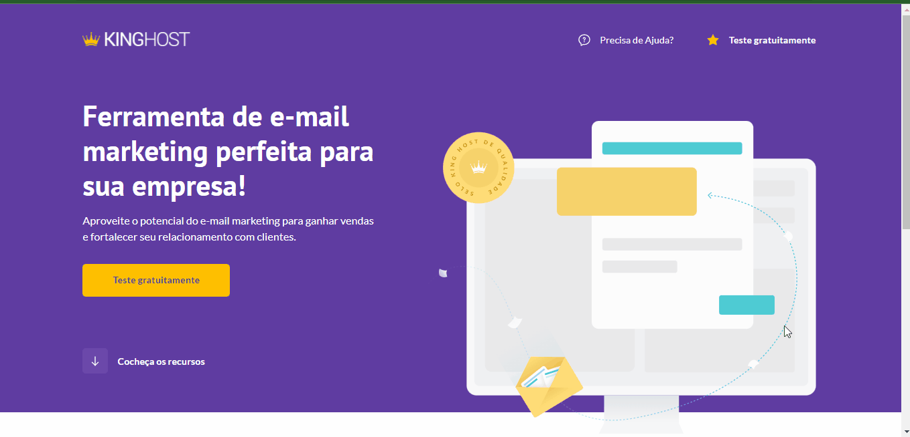
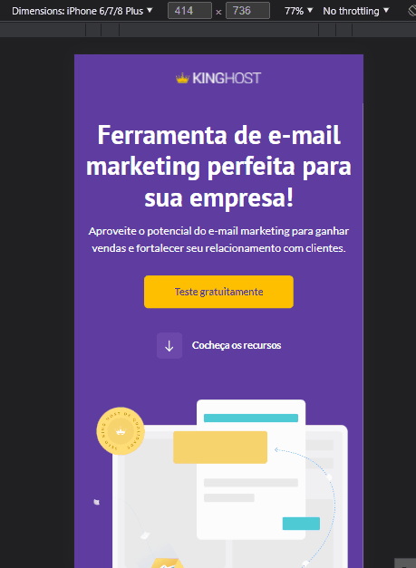
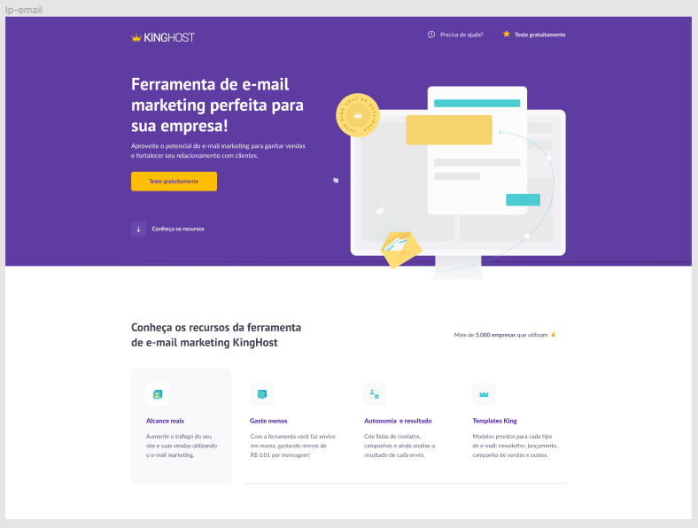
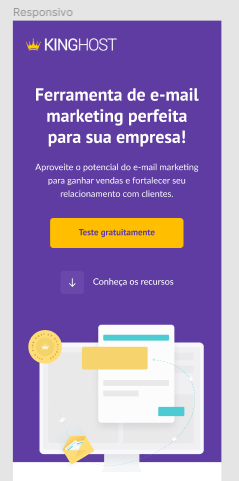
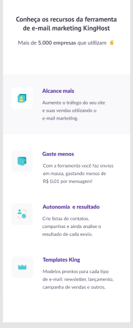
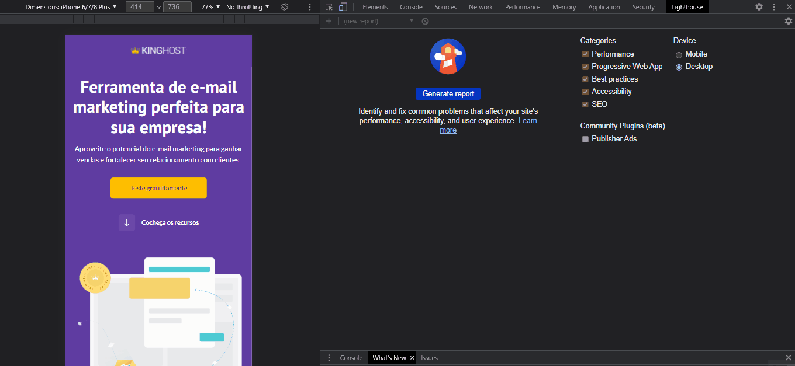

 

<h1 align="center">Welcome 👋 - Project KingHost CodeBoost </h1>

 <a href="#about">About</a> •
 <a href="#layout">Layout</a> •
 <a href="#deploy">Deploy</a> •
 <a href="#audit">Audit Metrics</a> •
 <a href="#challenges">Challenges</a> •
 <a href="#technologies">Technologies</a> •
 <a href="#autor">Autor</a>

 
<h3 align="center"><strong>Desktop model</strong></h3>

  
  <h3 align="center"><strong>Mobile model</strong></h3>

  

 

<h3 id="about"><strong>📝 About</strong></h3>

With the KingHost project we will carry out all the teachings of the SASS module. We'll see how important it is to our productivity to have a CSS preprocessor to help us.

 

<h3 id="layout"><strong>📐 Layout</strong></h3>

Design layout available in Mentor Will Moreira's CodeBoost course (Insany Design). For reasons of law I cannot grant access to the project. The original model of the project follows in PNG.
 
 
 

<h3 align="center"><strong>Desktop model</strong></h3>

  
  <h3 align="center"><strong>Mobile model 1</strong></h3>
  

  
  

  

<h3 id="deploy"><strong>🌐 Deploy</strong></h3>

[Github Pages](https://andremksdev.github.io/codeboost-project-kingHost/)

 

<h3 id="audit"><strong>🔍 Audit metrics - Lighthouse</strong></h3>

<h3><strong>Audit web apps with Lighthouse</strong></h3>

Lighthouse is an open-source automated tool that improves the quality of web apps. It can run as a Chrome extension or from the command line. Tell Lighthouse a URL you want to audit. It will run a series of tests on the page and report on the page's performance. In this report, you can use the tests that failed as indicators of what can be done to improve the application.

Note: Right now, Lighthouse focuses primarily on Progressive Web Apps features such as Add to Home screen and offline mode support. However, the overall goal of the project is to provide a comprehensive audit of all aspects of a web app's quality. 

 

  

 

<h3 id="challenges"><strong>🎯 Challenges</strong></h3>

- [x] Desktop version
- [x] Mobile version
- [x] Flexbox
- [x] Responsive
- [x] Use of SASS

 

<h3 id="technologies"><strong>⚙️ Technologies</strong></h3>

The technologies used for this project were:

- [HTML](https://developer.mozilla.org/en-US/docs/Web/HTML)
- [SASS](https://sass-lang.com/documentation)

 

<h3 id="autor"><strong>👨‍💻 Autor</strong></h3>

Made by andremksdev 👋

